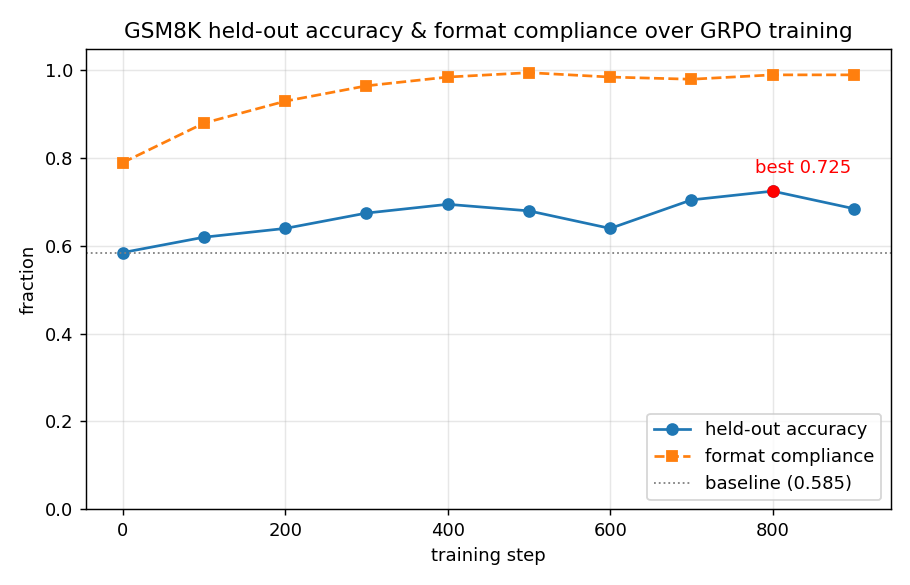
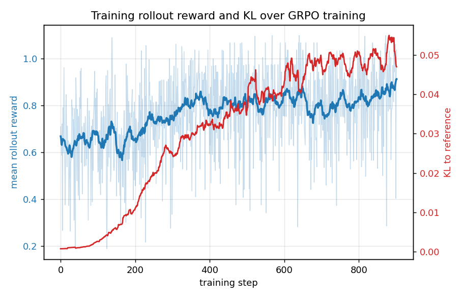

# tiny-reasoner — GRPO from scratch

Implementing **GRPO** (Group Relative Policy Optimization — the RL algorithm behind
DeepSeek-R1) **from scratch in PyTorch**, and using it to post-train
**Qwen2.5-1.5B-Instruct** on grade-school math (GSM8K) with verifiable rewards.

> **"From scratch"** means the RL machinery is hand-written — the rollout loop,
> reward functions, group-relative advantages, the clipped policy-gradient loss, the KL
> term, masking, and the training loop. Hugging Face `transformers` provides only the
> model weights and tokenizer. No `trl.GRPOTrainer`.

## Result

Held-out GSM8K accuracy **0.585 → 0.725 (+14 points)** and format compliance
**0.79 → 0.99**, on a fixed 200-question test set, after ~800 GRPO steps on one A100.



| | baseline | trained (best, step 800) |
|---|---|---|
| **held-out accuracy** | 0.585 | **0.725** |
| **format compliance** | 0.79 | 0.99 |
| KL to reference | 0 | ~0.05 (bounded) |

Two findings worth stating plainly:

- **The gains are real reasoning, not reward-hacking the format.** Format compliance
  saturated (~0.99) by step ~400, but accuracy kept climbing afterward (0.695 → 0.725).
  If the model were just farming the small format bonus, accuracy would have flat-lined
  once format maxed out. It didn't.
- **Reasoning got *better*, not *longer*.** Completion length actually drifted slightly
  down (166 → 155 tokens) — this is *not* the R1 "emergent long chain-of-thought" story.
  The model learned to interpret problems correctly and commit to a clean output format.
  (Length growth tends to require harder, longer-horizon tasks; GSM8K is short and the
  base model already does CoT.)



## How GRPO works (the one idea)

For each question, sample a **group** of G answers, score each with a verifiable reward
(did the final number match the gold answer? + a small format bonus), and use the
**group's mean reward as the baseline**:

```
advantage_i = (reward_i − mean(group)) / (std(group) + ε)
```

Answers that beat their siblings get pushed up; worse ones get pushed down. That group
mean replaces PPO's learned value network — **there is no critic** — which is what makes
GRPO cheap enough to run on modest hardware. The update is a PPO-style clipped
policy-gradient on the per-token log-probabilities, with an optional KL penalty against
a frozen reference model to prevent the policy from drifting into degeneracy.

## Repo layout

| file | what it does |
|------|--------------|
| `configs.py` | one `Config` dataclass + presets (`tiny` CPU smoke / `gpu`), `--set k=v` overrides |
| `data.py` | load GSM8K, parse gold answers, build `<think>/<answer>` prompts |
| `rewards.py` | answer extraction + correctness (1.0) and format (0.1) rewards |
| `rollout.py` | sample G completions; per-token log-probs with the off-by-one shift + completion masking |
| `grpo.py` | group-relative advantages + the clipped surrogate + k3 KL loss |
| `train.py` | the training loop: rollout → reward → advantage → loss → step, with periodic eval + checkpointing |
| `eval.py` | held-out accuracy (greedy), with `--adapter` to load a trained LoRA checkpoint |
| `plot.py` | result curves from `metrics.jsonl` |
| `tests/` | 48 unit tests (rewards, log-prob alignment, loss math) |

The implementation notes, design decisions, and every bug-and-fix along the way are in
[`details.md`](details.md) — a phase-by-phase engineering journal.

## Reproduce

```bash
pip install -r requirements.txt

# unit tests (CPU, seconds)
pytest -q

# CPU smoke of the whole loop on a tiny model (no GPU needed)
python train.py --config tiny --overfit

# baseline accuracy of the untrained model (GPU)
python eval.py --config gpu --set eval_n=200

# train (A100 80 GB; see configs.py for 24 GB sizing)
python train.py --config gpu

# evaluate the trained adapter
python eval.py --config gpu --adapter runs/gpu/best --set eval_n=500

# plots
python plot.py --metrics runs/gpu/metrics.jsonl --out assets
```

**Hardware:** trained on one A100 80 GB (LoRA + bf16 + gradient checkpointing, in-memory
batch 32, ~1000 optimizer updates, ~6 h). The code runs end-to-end on CPU with the
`tiny` preset for development, and fits a 24 GB card by lowering `prompts_per_step` and
raising `grad_accum_steps`.

## Engineering notes

- **Verifiable rewards.** Math answers are *checked*, not judged by a learned reward
  model — so the reward signal is a fact and RL stays stable. Correctness (1.0) ≫ format
  (0.1) so the model can't get a good score by formatting nicely while being wrong.
- **The reference model is free with LoRA.** The KL term needs a frozen copy of the
  original model; with LoRA we get it by *disabling the adapters* — no second model in
  memory.
- **Memory has two ceilings.** At small batch the LM-head logits (`B × T × 152k vocab`)
  dominate; at large batch the stored activations (`B × T × layers`) do. Gradient
  checkpointing (recompute activations in backward) is the lever to push batch higher.
- **Generation is ~90% of wall-clock** (333 min rollout vs 36 min update over the run).
  The training step is cheap; the bottleneck is sampling — a systems problem.

## Known limitations & next steps

- **Single-update, on-policy regime** (one gradient step per rollout → `ratio ≈ 1`), so
  the PPO clip never actually engages here. Multiple inner epochs per rollout would
  exercise it.
- **Ablations (in progress):** no-KL vs KL, group size G, advantage std-normalization
  on/off — the controlled comparisons that turn a result into an understanding.
- **Known follow-up algorithms:** **DAPO** (drops the KL term, decoupled clipping,
  token-level loss) and **Dr. GRPO** (fixes a length/difficulty bias from std-based
  advantage normalization). Both are config flags away in this codebase
  (`kl_beta=0`, `loss_agg=token`, `normalize_advantage=false`).
- **Faster rollouts:** generation dominates wall-clock, so a vLLM rollout path (paged
  KV-cache, continuous batching) is the highest-leverage speedup.

## References

- DeepSeekMath (introduces GRPO): https://arxiv.org/abs/2402.03300
- DeepSeek-R1 (RL for reasoning): https://arxiv.org/abs/2501.12948
- PPO (the clipped objective GRPO inherits): https://arxiv.org/abs/1707.06347
- Cameron R. Wolfe, GRPO deep dive: https://cameronrwolfe.substack.com/p/grpo
